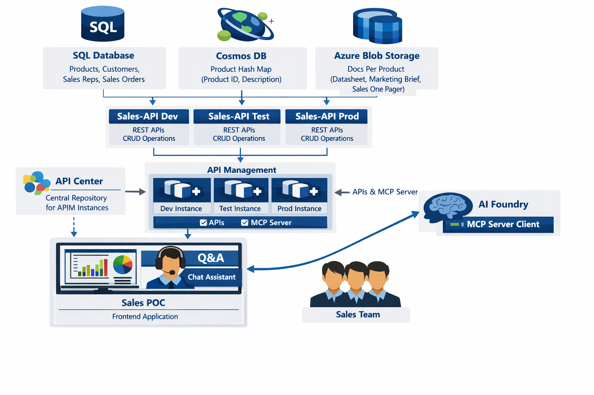

# SalesPOC.UI

A modern Angular-based sales management dashboard application that provides comprehensive views of customers, products, sales representatives, orders, and sales analytics. The application features an AI-powered chatbot for natural language queries powered by Microsoft Foundry Agent.

## Live Application

The application is deployed and accessible at: **[https://salespoc.azurewebsites.net](https://salespoc.azurewebsites.net)**

## Architecture



## Related Repositories

| Repository | Description |
|---|---|
| [SalesPOC.API](https://github.com/csdmichael/SalesPOC.API) | REST API (Azure App Service) |
| [SalesPOC.Containerized.API](https://github.com/csdmichael/SalesPOC.Containerized.API) | REST API (Azure Container Apps) |
| [SalesPOC.DB](https://github.com/csdmichael/SalesPOC.DB) | Database project |
| [SalesPOC.AI](https://github.com/csdmichael/SalesPOC.AI) | AI Agent (Azure AI Foundry) |

## UI Screenshots

<table>
  <tr>
    <td align="center"><b>Customers</b><br/><a href="UI%20Screenshots/Customers.png" target="_blank"></a></td>
    <td align="center"><b>Products</b><br/><a href="UI%20Screenshots/Products.png" target="_blank"></a></td>
    <td align="center"><b>Sales Reps</b><br/><a href="UI%20Screenshots/Sales%20Reps.png" target="_blank"></a></td>
  </tr>
  <tr>
    <td align="center"><b>Sales Orders</b><br/><a href="UI%20Screenshots/Sales%20Orders.png" target="_blank"></a></td>
    <td align="center"><b>Sales Facts (Stats)</b><br/><a href="UI%20Screenshots/Sales%20Facts%20(Stats).png" target="_blank"></a></td>
    <td align="center"><b>Sales Assistant</b><br/><a href="UI%20Screenshots/Sales%20Assistant.png" target="_blank"></a></td>
  </tr>
</table>

## Project Overview

This is a proof-of-concept (POC) frontend application built with Angular 21 that consumes SalesPOC.API REST APIs. The application provides a multi-page interface for managing and viewing sales data with interactive filters and data visualization capabilities.

### Key Features

- **Customer Management**: View and manage customer information
- **Product Catalog**: Browse products with filtering capabilities
- **Sales Representatives**: Manage sales rep data
- **Sales Orders**: Track and manage sales orders with detailed item information
- **Sales Analytics**: View sales facts and performance metrics
- **AI Chatbot**: Natural language interface powered by Microsoft Foundry Agent for querying sales data

## Sales Chat Assistant

The application includes an AI-powered Sales Chat Assistant that allows you to interact with your sales data using natural language. The chat icon is located at the **bottom right corner** of the screen.

### Sample Questions to Ask

Here are some example queries you can ask the Sales Chat Assistant:

1. List Products
2. List Customers
3. What is product description for Chip-50? Also retrieve Sales One Pager, Datasheet and market brief documentation. Finally check its unit price and status of its life cycle
4. List Products of category as Sensor
5. What is description of chip-16?
6. Plot top 10 products by price on a bar chart
7. How many units did Sales Rep 10 sell?
8. What is total amount for Sales Orders for Customer 1 that are confirmed? List them.
9. How many orders did customer 3 cancel?
10. Plot a bar chart for orders by total for Customer 1. Exclude cancelled orders


## API Center

The APIs used by this application are documented in the Azure API Center:

**API Center URL**: [https://api-center-poc-my.portal.eastus.azure-apicenter.ms/](https://api-center-poc-my.portal.eastus.azure-apicenter.ms/)

### APIs Used in This Application

1. **Sales API MCP** (production, mcp) - Used by AI Foundry Sales Agent
2. **SalesAPI** (production, rest)


## Technology Stack

- **Framework**: Angular 21.1.0
- **Language**: TypeScript 5.9.2
- **Styling**: SCSS
- **HTTP Client**: Angular HttpClient
- **Routing**: Angular Router (standalone components)
- **Build Tool**: Angular CLI 21.1.3
- **Package Manager**: npm 11.6.2

## Project Architecture

### Application Structure

The application follows Angular best practices with a modular, component-based architecture:

```
SalesPOC.UI/
├── src/
│   ├── app/
│   │   ├── components/          # Reusable UI components
│   │   │   └── chatbot/         # AI chatbot component
│   │   ├── pages/               # Page-level components
│   │   │   ├── customers/       # Customers page
│   │   │   ├── products/        # Products page
│   │   │   ├── sales-reps/      # Sales representatives page
│   │   │   ├── sales-orders/    # Sales orders page
│   │   │   └── sales-facts/     # Sales analytics page
│   │   ├── services/            # Business logic and API integration
│   │   │   ├── chat.service.ts
│   │   │   ├── customer.service.ts
│   │   │   ├── order-item.service.ts
│   │   │   ├── product.service.ts
│   │   │   ├── sales-fact.service.ts
│   │   │   ├── sales-order.service.ts
│   │   │   └── sales-rep.service.ts
│   │   ├── models/              # TypeScript interfaces and data models
│   │   │   ├── chat-message.model.ts
│   │   │   ├── customer.model.ts
│   │   │   ├── order-item.model.ts
│   │   │   ├── product.model.ts
│   │   │   ├── sales-fact.model.ts
│   │   │   ├── sales-order.model.ts
│   │   │   └── sales-rep.model.ts
│   │   ├── app.ts               # Root component (uses app.ts instead of conventional app.component.ts)
│   │   ├── app.config.ts        # Application configuration
│   │   ├── app.routes.ts        # Route definitions
│   │   ├── app.html             # Root template
│   │   └── app.scss             # Root styles
│   ├── environments/            # Environment-specific configurations
│   │   ├── environment.ts       # Development environment
│   │   └── environment.prod.ts  # Production environment
│   ├── index.html               # Main HTML file
│   ├── main.ts                  # Application bootstrap
│   └── styles.scss              # Global styles
├── public/                     # Static assets
├── angular.json               # Angular CLI configuration
├── tsconfig.json              # TypeScript configuration
├── proxy.conf.json            # API proxy configuration
└── package.json               # Dependencies and scripts
```

### Architecture Patterns

1. **Component-Based Architecture**: The application is built using standalone Angular components, promoting modularity and reusability.

2. **Service Layer**: All API communication is abstracted into dedicated service classes, following the single responsibility principle.

3. **Model-Driven**: TypeScript interfaces define the data structure for type safety and better IDE support.

4. **Route-Based Navigation**: The application uses Angular Router with lazy loading capabilities for optimal performance.

5. **Proxy Configuration**: API requests are proxied through `proxy.conf.json` to the Azure API Management endpoint (`https://apim-poc-my.azure-api.net/v1`).

### Data Flow

1. User interacts with page components (e.g., CustomersComponent)
2. Component calls appropriate service (e.g., CustomerService)
3. Service makes HTTP request to backend API via proxy
4. Response is mapped to model interfaces
5. Component updates view with data

### Routing Structure

- `/` → Redirects to `/customers`
- `/customers` → Customer management page
- `/products` → Product catalog page
- `/sales-reps` → Sales representatives page
- `/sales-orders` → Sales orders page
- `/sales-facts` → Sales analytics page

## Development server

To start a local development server, run:

```bash
ng serve
```

Once the server is running, open your browser and navigate to `http://localhost:4200/`. The application will automatically reload whenever you modify any of the source files.

**Note**: The API proxy is automatically configured in `angular.json` and will forward requests from `/api/*` to `https://apim-poc-my.azure-api.net/v1/*`.

## Building

To build the project run:

```bash
ng build
```

This will compile your project and store the build artifacts in the `dist/` directory. By default, the production build optimizes your application for performance and speed.

For production build:
```bash
ng build --configuration production
```

## Code scaffolding

Angular CLI includes powerful code scaffolding tools. To generate a new component, run:

```bash
ng generate component component-name
```

For a complete list of available schematics (such as `components`, `directives`, or `pipes`), run:

```bash
ng generate --help
```

## Configuration

### API Proxy

The application uses a proxy configuration (`proxy.conf.json`) to forward API requests during development:

```json
{
  "/api": {
    "target": "https://apim-poc-my.azure-api.net/v1",
    "secure": true,
    "changeOrigin": true,
    "logLevel": "debug"
  }
}
```

### Environment Configuration

Environment-specific settings are stored in `src/environments/`:
- `environment.ts` - Development configuration
- `environment.prod.ts` - Production configuration

## Additional Resources

- [Angular CLI Overview and Command Reference](https://angular.dev/tools/cli)
- [Angular Documentation](https://angular.dev)
- Project generated using [Angular CLI](https://github.com/angular/angular-cli) version 21.1.3
