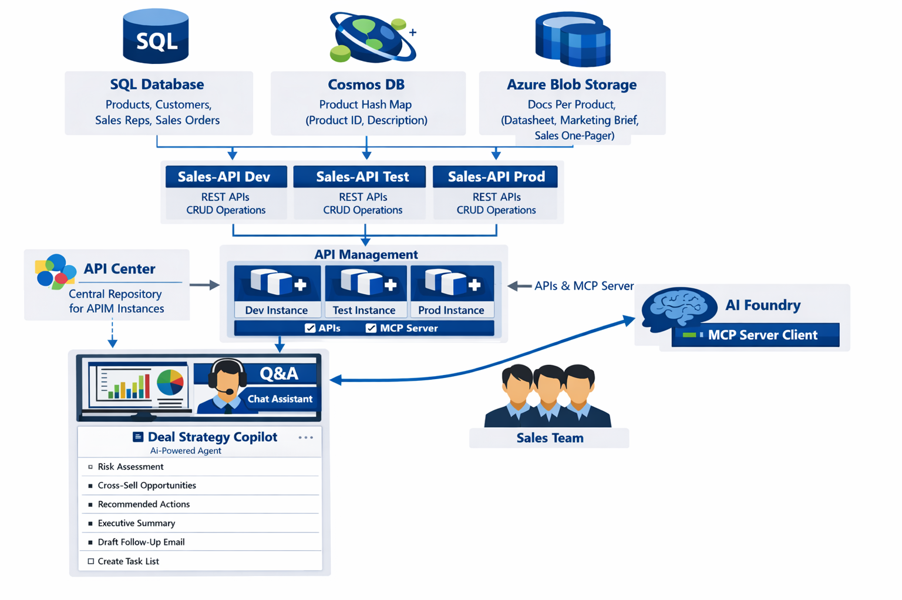

# SalesPOC.UI

A modern Angular-based sales management dashboard application that provides comprehensive views of customers, products, sales representatives, orders, and sales analytics. The application features an AI-powered chatbot for natural language queries powered by Microsoft Foundry Agent.

**🎉 Now a Hybrid/Cross-Platform Application!** Built with Ionic Framework and Capacitor, this app runs seamlessly on web, iOS, and Android devices.

## Live Application

The application is deployed and accessible at: **[https://salespoc.azurewebsites.net](https://salespoc.azurewebsites.net)**

## Architecture



## Presentation

A comprehensive presentation on how to implement the entire application and host it on Azure as a PaaS App is available here:

**[SalesPOC-CopilotSDK-Submission (PPTX)](presentations/SalesPOC-CopilotSDK-Submission.pptx)**

**[SalesPOC-CopilotSDK-Submission (PDF)](presentations/SalesPOC-CopilotSDK-Submission.pdf)**

**[Microsoft Azure Apps - Demo Sales POC (PDF)](presentations/Microsoft%20Azure%20Apps%20-%20Demo%20Sales%20POC.pdf)**

## Contest Submission Kit

For GitHub Copilot SDK Enterprise Challenge packaging, use:

- [AGENTS.md](AGENTS.md)
- [mcp.json](mcp.json)
- [Contest Summary](docs/contest-summary.md)
- [Contest Checklist](docs/contest-checklist.md)
- [Responsible AI Notes](docs/rai-notes.md)
- [Operational Readiness](docs/operational-readiness.md)
- [Presentations Folder](presentations/README.md)
- [Presentation Assets - Submission PPTX](presentations/SalesPOC-CopilotSDK-Submission.pptx)
- [Presentation Assets - Submission PDF](presentations/SalesPOC-CopilotSDK-Submission.pdf)
- [Presentation Assets - Demo PDF](presentations/Microsoft%20Azure%20Apps%20-%20Demo%20Sales%20POC.pdf)

## Related Repositories

| Repository | Description |
|---|---|
| [SalesPOC.API](https://github.com/csdmichael/SalesPOC.API) | REST API (Azure App Service) |
| [SalesPOC.Containerized.API](https://github.com/csdmichael/SalesPOC.Containerized.API) | REST API (Azure Container Apps) |
| [SalesPOC.DB](https://github.com/csdmichael/SalesPOC.DB) | Database project |
| [SalesPOC.AI](https://github.com/csdmichael/SalesPOC.AI) | AI Agent (Azure AI Foundry) |
| [SalesPOC.APIM](https://github.com/csdmichael/SalesPOC.APIM) | API Management |
| [SalesPOC.APIC](https://github.com/csdmichael/SalesPOC.APIC) | API Center project |

## UI Screenshots

| Screenshot | Description |
|---|---|
| <a href="docs/UI%20Screenshots/01.%20Home.png" target="_blank"></a><br/><b>1) Home</b> | Landing page with navigation entry points into dashboards, data views, and AI-assisted workflows. |
| <a href="docs/UI%20Screenshots/02.%20Customers.png" target="_blank"></a><br/><b>2) Customers</b> | Customer listing with filters, pagination, and quick navigation to each customer account. |
| <a href="docs/UI%20Screenshots/03.%20Customer%20Account%20-%20Copilot%20Analyzing%20Deal%20Strategy.png" target="_blank"></a><br/><b>3) Customer Account - Copilot Analyzing Deal Strategy</b> | Customer account detail view showing the side-panel copilot running contextual strategy analysis. |
| <a href="docs/UI%20Screenshots/04.%20Customer%20Account%20-%20CopilotDeal%20Strategy%20Result.png" target="_blank"></a><br/><b>4) Customer Account - Copilot Deal Strategy Result</b> | Structured strategy output with risk, cross-sell recommendations, actions, and executive summary. |
| <a href="docs/UI%20Screenshots/04.a.%20Customer%20Account%20-%20CopilotDeal%20Strategy%20-%20Draft%20Email.png" target="_blank"></a><br/><b>4a) Draft Email – Progress</b> | Progress bar shown while the Deal Strategy agent drafts a contextual email based on the analysis. |
| <a href="docs/UI%20Screenshots/04.b.%20Customer%20Account%20-%20CopilotDeal%20Strategy%20-%20Drafted%20Email.png" target="_blank"></a><br/><b>4b) Drafted Email</b> | Completed AI-drafted email with subject and body, highlighted on arrival, with a one-click Copy button. |
| <a href="docs/UI%20Screenshots/04.c.%20Customer%20Account%20-%20CopilotDeal%20Strategy%20-%20Export%20Summary.png" target="_blank"></a><br/><b>4c) Export Summary</b> | Print-to-PDF view of the full deal strategy with risk, cross-sell, actions, and executive summary. |
| <a href="docs/UI%20Screenshots/05.%20Products.png" target="_blank"></a><br/><b>5) Products</b> | Product catalog view with category/status filters and expandable product details. |
| <a href="docs/UI%20Screenshots/06.%20Sales%20Reps.png" target="_blank"></a><br/><b>6) Sales Reps</b> | Sales representative directory with regional filtering and performance-oriented lookup. |
| <a href="docs/UI%20Screenshots/07.%20Sales%20Orders.png" target="_blank"></a><br/><b>7) Sales Orders</b> | Sales order management screen with order status visibility and customer/rep context. |
| <a href="docs/UI%20Screenshots/08.%20Sales%20Facts.png" target="_blank"></a><br/><b>8) Sales Facts</b> | Transactional sales fact table for detailed analytics slicing by customer, product, and region. |
| <a href="docs/UI%20Screenshots/09.%20Sales%20Trend.png" target="_blank"></a><br/><b>9) Sales Trend</b> | Trend analytics view showing performance movement over time. |
| <a href="docs/UI%20Screenshots/10.%20Sales%20Statistics.png" target="_blank"></a><br/><b>10) Sales Statistics</b> | Statistical dashboard for aggregated KPIs and top-level sales insights. |
| <a href="docs/UI%20Screenshots/11.%20Sales%20by%20Region.png" target="_blank"></a><br/><b>11) Sales by Region</b> | Geographic sales visualization highlighting regional contribution and concentration. |
| <a href="docs/UI%20Screenshots/12.%20Sales%20Agents%20Example%20Prompts.png" target="_blank"></a><br/><b>12) Sales Agents Example Prompts</b> | Prompt gallery with reusable examples for business and analytics questions. |
| <a href="docs/UI%20Screenshots/13.%20Sales%20Agent%20-%20Plot%20top%20products%20by%20Price.png" target="_blank"></a><br/><b>13) Sales Agent - Plot Top Products by Price</b> | AI assistant response rendering a charted analysis for top products by unit price. |
| <a href="docs/UI%20Screenshots/14.%20Sales%20Agent%20-%20Product%20data%20from%20multiple%20sources.png" target="_blank"></a><br/><b>14) Sales Agent - Product Data from Multiple Sources</b> | AI response combining product records, descriptions, and supporting document references. |

## Project Overview

This is a proof-of-concept (POC) frontend application built with Angular 21 that consumes SalesPOC.API REST APIs. The application provides a multi-page interface for managing and viewing sales data with interactive filters and data visualization capabilities.

### Key Features

- **Customer Management**: View and manage customer information
- **Product Catalog**: Browse products with filtering capabilities
- **Sales Representatives**: Manage sales rep data
- **Sales Orders**: Track and manage sales orders with detailed item information
- **Sales Analytics**: View sales facts and performance metrics
- **AI Chatbot**: Natural language interface powered by Microsoft Foundry Agent for querying sales data
- **🆕 Cross-Platform**: Runs on web browsers, iOS devices, and Android devices
- **🆕 Responsive Design**: Adaptive UI with Ionic components that work seamlessly on all screen sizes
- **🆕 Native Features**: Ready for native device capabilities through Capacitor

## Deal Strategy Copilot

The application includes a contextual **Deal Strategy Copilot** on the customer account page.

### Where to Access

- Open **Customers**
- Select a customer to navigate to `/customers/:customerId`
- The Deal Strategy Copilot appears in the right-side panel

### How It Works

On page load, the copilot receives account context to ground responses and reduce unnecessary calls:

- `customerId`
- `region`
- `repId`
- `userRole`

It then auto-runs account analysis and returns a structured strategy response.

### Structured Output

- **Risk Card**: Highlights key risks and blockers for the account
- **Cross-Sell Card**: Identifies relevant upsell/cross-sell opportunities
- **Recommended Actions**: Lists concrete next steps for the sales team
- **Executive Summary**: Provides an expandable concise strategy brief

### Action Buttons

From the copilot panel, users can trigger follow-up actions:

- **Create Task**
- **Draft Email**
- **Export Summary**

## Sales Chat Assistant

The application includes an AI-powered Sales Chat Assistant that allows you to interact with your sales data using natural language. The chat icon is located at the **bottom right corner** of the screen.

### Sample Questions to Ask

Here are some example queries you can ask the Sales Chat Assistant:

**Basic**
1. List Products
2. List Customers

**Medium**
1. List Products of category as Sensor
2. What is description of chip-16?
3. Plot top 10 products by price on a bar chart
4. How many units did Sales Rep 10 sell?
6. How many orders did customer 3 cancel?

**Advanced**
1. What is product description for Chip-50? Also retrieve Sales One Pager, Datasheet and market brief documentation. Finally check its unit price and status of its life cycle
2. From Sales Facts, show top 3 Research Customers by Line Total in West Region
3. What is total amount for Sales Orders for Customer 1 that are confirmed? List them.
4. Plot a bar chart for orders by total for Customer 1. Exclude cancelled orders


## API Center

The APIs used by this application are documented in the Azure API Center:

**API Center URL**: [https://api-center-poc-my.portal.eastus.azure-apicenter.ms/](https://api-center-poc-my.portal.eastus.azure-apicenter.ms/)

### APIs Used in This Application

1. **Sales API MCP** (production, mcp) - Used by AI Foundry Sales Agent
2. **SalesAPI** (production, rest)


## Technology Stack

- **Framework**: Angular 21.1.0
- **UI Framework**: Ionic 8.7.17 (for hybrid/cross-platform support)
- **Native Runtime**: Capacitor 8.1.0 (for iOS and Android builds)
- **Language**: TypeScript 5.9.2
- **Styling**: SCSS with Ionic CSS utilities
- **HTTP Client**: Angular HttpClient
- **Routing**: Angular Router with Ionic Router Outlet (standalone components)
- **Build Tool**: Angular CLI 21.1.3
- **Package Manager**: npm 11.6.2

## Project Architecture

### Application Structure

The application follows Angular best practices with a modular, component-based architecture:

```
SalesPOC.UI/
├── src/
│   ├── app/
│   │   ├── components/          # Reusable UI components
│   │   │   └── chatbot/         # AI chatbot component
│   │   ├── pages/               # Page-level components
│   │   │   ├── customers/       # Customers page
│   │   │   ├── products/        # Products page
│   │   │   ├── sales-reps/      # Sales representatives page
│   │   │   ├── sales-orders/    # Sales orders page
│   │   │   └── sales-facts/     # Sales analytics page
│   │   ├── services/            # Business logic and API integration
│   │   │   ├── chat.service.ts
│   │   │   ├── customer.service.ts
│   │   │   ├── order-item.service.ts
│   │   │   ├── product.service.ts
│   │   │   ├── sales-fact.service.ts
│   │   │   ├── sales-order.service.ts
│   │   │   └── sales-rep.service.ts
│   │   ├── models/              # TypeScript interfaces and data models
│   │   │   ├── chat-message.model.ts
│   │   │   ├── customer.model.ts
│   │   │   ├── order-item.model.ts
│   │   │   ├── product.model.ts
│   │   │   ├── sales-fact.model.ts
│   │   │   ├── sales-order.model.ts
│   │   │   └── sales-rep.model.ts
│   │   ├── app.ts               # Root component (uses app.ts instead of conventional app.component.ts)
│   │   ├── app.config.ts        # Application configuration
│   │   ├── app.routes.ts        # Route definitions
│   │   ├── app.html             # Root template
│   │   └── app.scss             # Root styles
│   ├── environments/            # Environment-specific configurations
│   │   ├── environment.ts       # Development environment
│   │   └── environment.prod.ts  # Production environment
│   ├── index.html               # Main HTML file
│   ├── main.ts                  # Application bootstrap
│   └── styles.scss              # Global styles
├── public/                     # Static assets
├── angular.json               # Angular CLI configuration
├── tsconfig.json              # TypeScript configuration
├── proxy.conf.json            # API proxy configuration
└── package.json               # Dependencies and scripts
```

### Architecture Patterns

1. **Component-Based Architecture**: The application is built using standalone Angular components, promoting modularity and reusability.

2. **Service Layer**: All API communication is abstracted into dedicated service classes, following the single responsibility principle.

3. **Model-Driven**: TypeScript interfaces define the data structure for type safety and better IDE support.

4. **Route-Based Navigation**: The application uses Angular Router with lazy loading capabilities for optimal performance.

5. **Proxy Configuration**: API requests are proxied through `proxy.conf.json` to the Azure API Management endpoint (`https://apim-poc-my.azure-api.net/salesapi/v1`).

### Data Flow

1. User interacts with page components (e.g., CustomersComponent)
2. Component calls appropriate service (e.g., CustomerService)
3. Service makes HTTP request to backend API via proxy
4. Response is mapped to model interfaces
5. Component updates view with data

### Routing Structure

- `/` → Redirects to `/customers`
- `/customers` → Customer management page
- `/products` → Product catalog page
- `/sales-reps` → Sales representatives page
- `/sales-orders` → Sales orders page
- `/sales-facts` → Sales analytics page

## Development Server

To start a local development server, run:

```bash
npm start
# or
npm run ionic:serve
# or
ng serve
```

Once the server is running, open your browser and navigate to `http://localhost:4200/`. The application will automatically reload whenever you modify any of the source files.

**Note**: The API proxy is automatically configured in `angular.json` and will forward requests from `/api/*` to `https://apim-poc-my.azure-api.net/salesapi/v1/*`.

## Building

To build the project run:

```bash
npm run ionic:build
# or
ng build
```

This will compile your project and store the build artifacts in the `dist/` directory. By default, the production build optimizes your application for performance and speed.

For production build:
```bash
npm run ionic:build -- --configuration production
```

For development build:
```bash
npm run ionic:build -- --configuration development
```

## CI/CD Deployment (Azure Web App)

The GitHub workflow at `.github/workflows/main_salespoc.yml` is configured for the Ionic app:

- Installs dependencies with `npm ci`
- Builds with `npm run ionic:build -- --configuration development`
- Uploads compiled output from `dist/` as the deployment artifact
- Deploys `./dist` to Azure Web App (`SalesPOC`)

## Code scaffolding

Angular CLI includes powerful code scaffolding tools. To generate a new component, run:

```bash
ng generate component component-name
```

For a complete list of available schematics (such as `components`, `directives`, or `pipes`), run:

```bash
ng generate --help
```

## Configuration

### API Proxy

The application uses a proxy configuration (`proxy.conf.json`) to forward API requests during development:

```json
{
  "/api": {
    "target": "https://apim-poc-my.azure-api.net/salesapi/v1",
    "secure": true,
    "changeOrigin": true,
    "logLevel": "debug"
  }
}
```

### Environment Configuration

Environment-specific settings are stored in `src/environments/`:
- `environment.ts` - Development configuration
- `environment.prod.ts` - Production configuration

## Hybrid/Cross-Platform Development

This application uses **Ionic Framework** and **Capacitor** to provide a true hybrid experience that works seamlessly across web, iOS, and Android platforms.

### Ionic Framework

Ionic provides:
- Mobile-optimized UI components that adapt to platform conventions
- Responsive layouts that work on any screen size
- Native-like navigation and gestures
- Automatic theming based on the platform

### Building for Different Platforms

#### Web (Browser)
```bash
# Development server
npm start
# or
ng serve

# Production build
ng build --configuration production
```

#### iOS
```bash
# Build the web assets
ng build --configuration production

# Sync web assets to iOS
npx cap sync ios

# Open in Xcode
npx cap open ios

# Build and run from Xcode or command line
```

**Requirements**: macOS with Xcode installed

#### Android
```bash
# Build the web assets
ng build --configuration production

# Sync web assets to Android
npx cap sync android

# Open in Android Studio
npx cap open android

# Build and run from Android Studio or command line
```

**Requirements**: Android Studio with Android SDK installed

### Capacitor Configuration

The Capacitor configuration is stored in `capacitor.config.ts`:
- **App ID**: `com.salespoc.app`
- **App Name**: SalesPOC
- **Web Directory**: `dist`

### Adding Native Capabilities

To add native device features (camera, geolocation, etc.):

```bash
# Install a Capacitor plugin
npm install @capacitor/camera

# Sync with native projects
npx cap sync
```

### Platform-Specific Notes

- **iOS**: Native projects are in the `ios/` directory (excluded from git)
- **Android**: Native projects are in the `android/` directory (excluded from git)
- **Web**: Runs directly from the `dist/` directory after build

To regenerate native projects:
```bash
npx cap add ios
npx cap add android
```

## Additional Resources

- [Angular CLI Overview and Command Reference](https://angular.dev/tools/cli)
- [Angular Documentation](https://angular.dev)
- Project generated using [Angular CLI](https://github.com/angular/angular-cli) version 21.1.3
